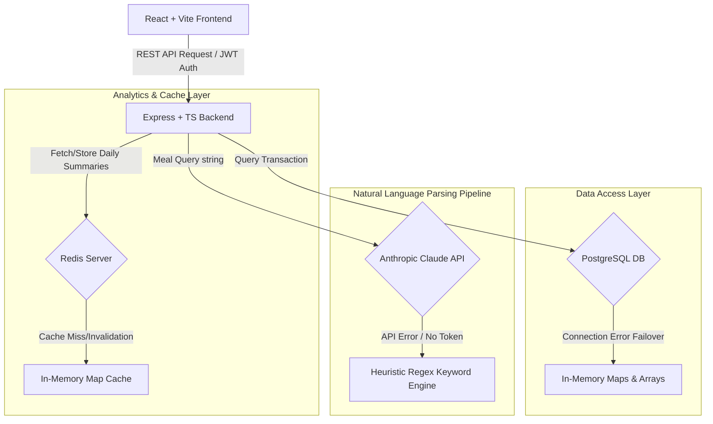

# 🦾 NEUTROBOT
### *The Ultimate High-Fidelity Nutrition & Wellness Analytics Platform*

[](https://react.dev/)
[](https://www.typescriptlang.org/)
[](https://nodejs.org/)
[](https://expressjs.com/)
[](https://www.postgresql.org/)
[](https://redis.io/)
[](https://www.prisma.io/)
[](https://threejs.org/)
[](https://www.framer.com/motion/)
[](https://www.anthropic.com/)

**Neutrobot** is a state-of-the-art, full-stack nutrition tracking and wellness analytics platform engineered to deliver premium performance, immersive aesthetics, and bulletproof failover resilience. Built with an editorial **Swiss Brutalist** design language, the application parses natural language meal inputs, aggregates nutritional insights, and optimizes biological markers through high-performance caching and adaptive systems engineering.

---

## 🎨 Design Philosophy & Visual Narrative
The application avoids generic templates in favor of a curated, high-end editorial design:
- **Swiss Brutalism**: Defined by rigid layouts, borderless structural sections, heavy outlines (`#1E1E1E`), high-contrast typography, and a warm organic paper background (`#E4E2DD`).
- **Interactive WebGL Atmosphere**: A customized Three.js physical cursor canvas rendering interactive 3D particle tubes on the landing page that dynamically randomize glowing neon colors upon interaction.
- **Micro-Animations**: Framer Motion orchestrates viewport-based entry transitions, smooth cubic-bezier page changes, and spring-smoothed parallax scroll velocity tracking.
- **Typography System**: Display elements utilize bold headlines set in **Clash Display**, while functional layout data is styled in **Satoshi** for maximum readability.

---

## 📐 System Architecture Diagram
The diagram below details the data flow from the interactive client through to the REST API endpoints, highlighting the database failovers and API fallback mechanisms:



---

## 🧠 Key Engineering Decisions & Resilience Design
This platform was built to demonstrate production-grade reliability and software design patterns:

### 1. Zero-Config Database Resilience (Failover-First Client)
- **Problem**: Traditional full-stack applications crash or fail to boot if PostgreSQL is down or if credentials are misconfigured.
- **Solution**: Engineered a resilient database bridge (`prisma.ts`). The initialization process runs a background connectivity verification check. If the connection fails, the application dynamically updates its internal references to direct traffic to robust **in-memory data stores** (using standard Javascript Maps and Arrays). Data operations remain completely functional.

### 2. High-Performance Caching Stratification
- **Problem**: Frequently recalculating daily nutrient aggregates for large food history collections strains database performance.
- **Solution**: Integrated a cache-aside pattern utilizing **Redis**. User queries fetch aggregated metrics from the cache (`nutrition_today_${userId}`). To keep cache coherency without polling, logging a new meal triggers a write-through cache invalidation (`DEL`) for that user key. If Redis is unavailable, the server automatically routes caching commands to an in-memory key-expiry registry.

### 3. Dual-Tier NLP Meal Parser Pipeline
- **Problem**: Network latency, API throttling, or an invalid Anthropic key can block core tracking capabilities.
- **Solution**: Developed a hybrid parsing engine (`routes/nutrition.ts`). The primary request goes to Anthropic's **Claude 3 Haiku** to generate strict schema-validated JSON containing macronutrients and nutrient recommendations. If the request fails, it instantly fails over to a local regex keyword heuristic parser that estimates nutritional density based on a pre-compiled lexicon of common food groups.

### 4. Non-Blocking 3D Canvas Rendering
- **Problem**: Heavy WebGL rendering in Three.js often causes main-thread blockages, layout thrashing, and low frame rates.
- **Solution**: Implemented a ref-based WebGL container (`TubesBackground.tsx`) running lazy-loaded asynchronous cursors. Dynamic pointer moves are pushed directly to the GPU shader coordinates, bypassing React's virtual DOM reconciliation cycle. Interactivity is capped at a responsive 60 FPS, automatically scaling down to simple vector graphics on touch/mobile viewports to preserve battery life.

---

## ⚡ Technical Stack Details

### Frontend Architecture
- **Framework**: React 18 + Vite (fast HMR, bundled assets).
- **Styling**: Tailwind CSS (Strict custom-defined brutalist spacing and border tokens).
- **Animations**: Framer Motion (Scroll velocity hooks, layout animations, custom cubic-bezier springs).
- **3D Physics**: Three.js (Dynamic Lissajous curve movement simulations).
- **Icons**: Lucide React.

### Backend Infrastructure
- **Server**: Node.js + Express (written in pure TypeScript with strict interface typings).
- **Data ORM**: Prisma Client with PostgreSQL adapter capabilities.
- **Cache**: Redis Client (using silent error catch blocks to prevent crashes on network drops).
- **Security**: JWT token generation and authentication middleware.

---

## 📁 Repository Structure
```
nutrobot/
├── backend/
│   ├── prisma/
│   │   ├── schema.prisma       # Database schemas & relations
│   │   └── migrations/
│   ├── src/
│   │   ├── middleware/
│   │   │   └── auth.ts         # JWT Authenticator & Route Guard
│   │   ├── routes/
│   │   │   ├── auth.ts         # Session management (Register/Login)
│   │   │   ├── user.ts         # User profiles (Retrieve/Update)
│   │   │   └── nutrition.ts    # AI-powered food parsing & cache control
│   │   ├── prisma.ts           # Resilient database connection wrapper
│   │   ├── redis.ts            # Resilient cache connection wrapper
│   │   └── index.ts            # Express Server entry point
│   ├── Dockerfile              # Containerization recipe
│   ├── package.json
│   └── tsconfig.json
│
└── frontend/
    ├── src/
    │   ├── components/
    │   │   ├── layout/         # Navbar, BackgroundBlobs, PageTransitions
    │   │   └── ui/             # Brutalist Button framework, Three.js Tubes Background
    │   ├── context/
    │   │   └── AuthContext.tsx # User session provider & client-side HTTP interceptor
    │   ├── pages/
    │   │   ├── AuthPage.tsx    # High-contrast Login/Signup panel
    │   │   ├── DashboardPage.tsx # Asymmetrical metrics grid
    │   │   ├── FoodLogPage.tsx # Natural-language logger console
    │   │   ├── HeroPage.tsx    # Parallax landing page with 3D canvas
    │   │   └── HistoryPage.tsx # Tabulated records list
    │   ├── App.tsx
    │   └── main.tsx
    ├── package.json
    └── tailwind.config.js
```

---

## 📡 API Endpoints Reference

### Authentication Services (`/api/auth`)
| Route | Method | Authentication | Payload | Description |
| :--- | :---: | :---: | :--- | :--- |
| `/register` | `POST` | None | `{ email, password, name }` | Registers a new user account and returns account metadata. |
| `/login` | `POST` | None | `{ email, password }` | Validates credentials and returns JWT bearer token. |

### User Profile Services (`/api/user`)
| Route | Method | Authentication | Payload | Description |
| :--- | :---: | :---: | :--- | :--- |
| `/` | `GET` | JWT Bearer | None | Fetches the authenticated user's profile information. |
| `/` | `PUT` | JWT Bearer | `{ name }` | Updates profile attributes. |

### Nutrition Services (`/api/nutrition`)
| Route | Method | Authentication | Payload | Description |
| :--- | :---: | :---: | :--- | :--- |
| `/analyze` | `POST` | JWT Bearer | `{ query }` | Sends plain English meal log to parser. Updates and invalidates Redis cache. |
| `/today` | `GET` | JWT Bearer | None | Returns today's logged foods and aggregated calories/macros (Redis Cached). |
| `/history` | `GET` | JWT Bearer | None | Returns a history list of all logged items. |

---

## 🛠️ Installation & Getting Started

### Prerequisites
- [Node.js](https://nodejs.org/en) (v18+ recommended)
- [PostgreSQL](https://www.postgresql.org/) (Optional, fallback-enabled)
- [Redis](https://redis.io/) (Optional, fallback-enabled)

### 1. Setup Backend Server
1. Navigate to the backend folder:
   ```bash
   cd backend
   ```
2. Install the production and development dependencies:
   ```bash
   npm install
   ```
3. Establish your local environment configuration:
   ```bash
   cp .env.example .env
   ```
   *(Configure your `DATABASE_URL` or `ANTHROPIC_API_KEY` in `.env` if using external instances, otherwise leave as-is to use internal mock engines).*
4. Run Prisma schema generation:
   ```bash
   npx prisma generate
   ```
5. Launch the backend server in development mode:
   ```bash
   npm run dev
   ```
   *The server defaults to port `5001`.*

### 2. Setup Frontend Client
1. Open a new terminal and navigate to the frontend directory:
   ```bash
   cd frontend
   ```
2. Install the required Node packages:
   ```bash
   npm install
   ```
3. Initialize the local Vite dev server:
   ```bash
   npm run dev
   ```
4. Access the client in your browser at `http://localhost:5173`.

---

## 🚀 Production Configuration
The application comes preconfigured for cloud hosting platforms:
- **Client**: Optimized static builds are deployed dynamically via Vercel (`vercel.json`).
- **Server**: Express microservice fits Docker containers via the root `Dockerfile` and is mapped for Render deployments (`render.yaml`).

---

## 🦾 Connect with the Architect
Feel free to reach out to discuss this project, potential system optimizations, or collaboration opportunities:

<a href="https://www.linkedin.com/in/pranajit-ai" target="_blank">
  
</a>
<a href="mailto:daspranajit973@gmail.com">
  
</a>
<a href="https://instagram.com/eccentric_pj" target="_blank">
  
</a>

**Pranajit Das** — *Full-Stack Developer & AI Systems Enthusiast*
